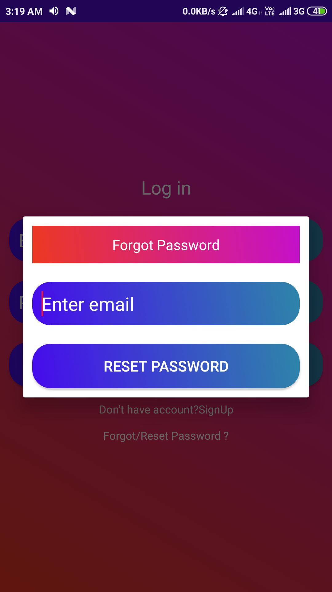

<a href="LICENSE" target="_blank"><a>
 

## About

Money Manager is and android based application use to keepping the records of expenditure .This app uses google cloud to store and access data hassle free for its user.

## Features
- Simple and minimal Layout Designs.
- Interactive user Interface
- Real-time Synchronization with Online Database.
- Security Rules to protect the database from malicious activities.

## Functionalities
- login feature for data protection
- Sum of total expenditure
- date of expenditure
- Type of Expenditure
- Notes (description of spent money)
- Modify previous logs
- delete previous logs
- forgot password option in case you loose password

## Security 
- Email verification
- Login details and device id verification to avoid fraud and Spamming
- device block if unusual activity detected

# Screenshots #

||||
|:--:|:--:|:--:|
|**Splashscreen**|**Login**|**Signup**|

||||
|:--:|:--:|:--:|
|**Expenditure List**|**Add New log**|**Edit Old logs**|

||
|:--:|
|**Forgot Password**|

## Tools Used
* [Android Studio](https://developer.android.com/studio) : Used as the Android developement environment.
* [Firebase Realtime Database](https://firebase.google.com/products/realtime-database) : Used as the backend database.
* [Firebase Storage](https://firebase.google.com/products/storage) : Use to store product Image
* [Firebase Authentication](https://firebase.google.com/products/auth) : Used to manage User information

## Contributing
You are welcome to contribute :

1. [Fork it](https://github.com/saurabhpandey9/Money-Manager/fork) :`https://github.com/saurabhpandey9/Money-Manager/fork`
2. Create new branch : `git checkout -b new_feature`
3. Commit your changes : `git commit -am 'Added new_feature'`
4. Push to the branch : `git push origin new_feature`
5. Submit a pull request !

## Author 
**Thanks for going through this Repository! Have a nice day.** 
 **Saurabh Pandey**  
#### Contact :`saurabh17100@gmail.com`

## License
This Project is licensed under the MIT License, see the [LICENSE](LICENSE) file for details.
 
 

